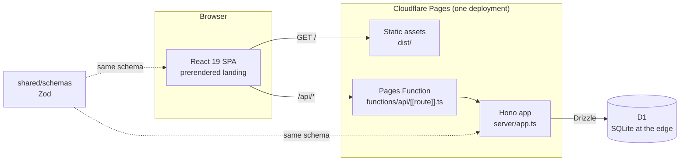
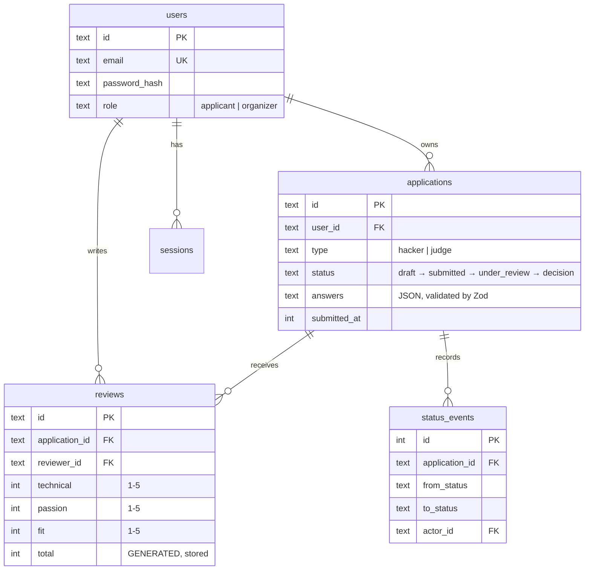
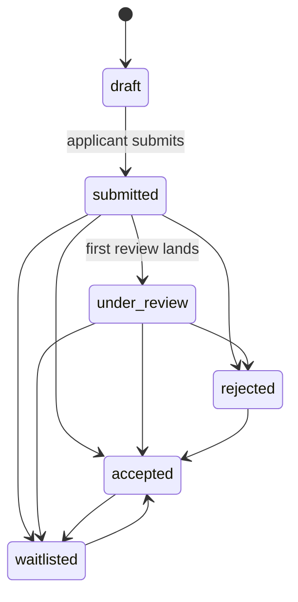

<div align="center">

# not-cal-hacks

**Apply in five minutes. Reviewed in thirty seconds.**

A hackathon application portal for both sides of the table. Applicants fill one form
and watch it move. Organizers read it blind, score it against a rubric everyone
shares, and get back to people before the suns come up.

[**Live → not-cal-hacks.pages.dev**](https://not-cal-hacks.pages.dev)

[](https://github.com/KarthikSubramanian07/not-cal-hacks/actions/workflows/ci.yml)
[](https://github.com/KarthikSubramanian07/not-cal-hacks/actions/workflows/deploy.yml)
[](LICENSE)

`React 19` · `TypeScript` · `Hono` · `Cloudflare Pages` · `D1` · `Drizzle` · `Zod` · `83 tests`

</div>

> [!NOTE]
> Not affiliated with, endorsed by, or legally distinguishable from any similarly
> named hackathon. Any resemblance to events held in Berkeley is a coincidence
> this repository is not prepared to discuss further.

---

## Requirements checklist

Everything the brief asked for, and where to find it. All links are live.

| #   | Requirement                                                 | Where it is                                                                                                                                                                                                                                                                          | Status |
| --- | ----------------------------------------------------------- | ------------------------------------------------------------------------------------------------------------------------------------------------------------------------------------------------------------------------------------------------------------------------------------ | ------ |
| 1   | **Sign-in and application forms backed by a real database** | [`/signup`](https://not-cal-hacks.pages.dev/signup) → [`/apply`](https://not-cal-hacks.pages.dev/apply) · Cloudflare **D1**, schema in [`server/db/schema.ts`](server/db/schema.ts)                                                                                                  | ✅     |
| 2   | **Multiple account types, each with their own application** | **Hacker** → [`/apply/hacker`](https://not-cal-hacks.pages.dev/apply/hacker) · **Judge** → [`/apply/judge`](https://not-cal-hacks.pages.dev/apply/judge) · picker at [`/apply`](https://not-cal-hacks.pages.dev/apply) · separate Zod schemas in [`shared/schemas/`](shared/schemas) | ✅     |
| 3   | **Review and grade applications**                           | [`/admin/review`](https://not-cal-hacks.pages.dev/admin/review) · three-criterion rubric, 1–5, keyboard-driven                                                                                                                                                                       | ✅     |
| 4   | **A page listing all applications and their statuses**      | [`/admin`](https://not-cal-hacks.pages.dev/admin) · filter by type and status, search, sort, inline decisions, CSV export                                                                                                                                                            | ✅     |
| 5   | **One feature of your choosing**                            | **Blind review queue + calibration.** Server-side redaction, least-reviewed-first ordering, and a strip comparing your average to the team's                                                                                                                                         | ✅     |
| 6   | **Deployed at a public URL**                                | **[not-cal-hacks.pages.dev](https://not-cal-hacks.pages.dev)** · Cloudflare Pages, deploys on every push to `main`                                                                                                                                                                   | ✅     |

**Sign in as `organizer@notcalhacks.dev` / `demo1234` to see 3, 4 and 5 immediately.**
Hacker and judge demos are on the same page: pick a door at [`/apply`](https://not-cal-hacks.pages.dev/apply).

### About requirement 5

The brief asked for one feature. There are three, because they only work together:

1. **Blind review.** Identity is stripped _on the server_, so it never reaches the browser unless a reviewer explicitly asks. Reviewers get a stable call sign (`#A3F9`) to argue about instead.
2. **A queue that spreads coverage.** `Review next` serves the least-reviewed application you have not scored. Left alone, reviewers all open the top of the list and the same twenty applications get five reads each while the tail gets none.
3. **Calibration.** A quiet strip shows your average beside the team's. Nobody is ranked; most drift corrects itself the moment it becomes visible.

---

## Try it in thirty seconds

Two seeded accounts, both on the live site. Nothing you do to them matters.

| Role          | Email                       | Password   | What you get                                                                  |
| ------------- | --------------------------- | ---------- | ----------------------------------------------------------------------------- |
| **Organizer** | `organizer@notcalhacks.dev` | `demo1234` | 27 applications, a live review queue, calibration against two other reviewers |
| **Hacker**    | `hacker@notcalhacks.dev`    | `demo1234` | One application under review, one untouched judge draft                       |
| **Judge**     | `judge@notcalhacks.dev`     | `demo1234` | A submitted judge application already in the queue                            |

Or just sign up. The whole applicant path works for a stranger with no invite.

---

## What it actually does

**For the person applying.** One account covers hacker and judge. The form is
three short sections, it autosaves on an 800ms debounce, and it merges rather than
replaces, so a half-typed essay survives a closed tab. Submitting locks it and starts
a timeline built from an append-only audit table, which means the status page cannot
tell you something different from what the organizers see.

**For the person reviewing.** The queue hands out the least-reviewed application you
have not already scored. There is no list to choose from, because choosing what to
open next is the decision that wastes the weekend. Number keys score the focused
criterion and advance, command-enter files it and pulls the next one in. A quiet strip
shows your average next to the team's.

**Blind review is the default and it is real.** Names, emails and profile links are
stripped _on the server_ before an application is serialized. Not hidden with CSS, not
filtered in a component. If a reviewer has not asked to see who wrote it, the browser
never receives it.

```
                 blind=1 (default)                      blind=0
  ┌────────────────────────────────┐    ┌────────────────────────────────┐
  │ #5938              MENTOR      │    │ Dev Chatterjee     MENTOR      │
  │ School   City College of SF    │    │ School   City College of SF    │
  │ Company  Databricks            │    │ Company  Databricks            │
  │ ── name and links withheld ──  │    │ github.com/dev11               │
  └────────────────────────────────┘    └────────────────────────────────┘
        the server sent no name              the reviewer asked for it
```

---

## How it is put together



The frontend and the API ship as **one deployment**. There is no second origin, no
CORS configuration, and no way for the two halves to drift to different versions.

### The data model



`applications(user_id, type)` is unique, so one person holds at most one hacker
application and one judge application. `reviews(application_id, reviewer_id)` is
unique, so scoring something twice updates your review instead of stacking another
one, which is why an average means what it appears to mean.

### The status machine



Nothing returns to `draft`: submitting is final. Decisions **are** reversible, because
organizers change their minds and a waitlist that cannot be promoted is not a waitlist.
The machine lives in [`shared/transitions.ts`](shared/transitions.ts) as data, so it is
testable on its own and the server refuses anything it does not allow.

---

## Decisions worth arguing about

<details>
<summary><b>Cloudflare D1 instead of Supabase</b></summary>

<br>

The brief said Supabase. The deploy target here is Cloudflare Pages, and putting the
database on the same platform means the whole thing is one deployment with one set of
credentials and no cross-origin anything.

The honest cost: **D1 has no row-level security.** In a Postgres deployment, RLS is a
second wall behind the application, so an authorization bug in a handler still fails
closed. Here there is no second wall, which makes the application _the_ wall. So
authorization is one shared middleware plus an explicit ownership check at every point
of use, and the test suite spends most of its time trying to get around it: one
applicant reading another's application, an applicant hitting every admin route, an
applicant editing a submitted form, an organizer reading an unsubmitted draft.

</details>

<details>
<summary><b>One JSON column for answers</b></summary>

<br>

The two application types share about half their fields and differ on the rest. A wide
nullable table means a column per type-specific field and a NULL for everyone else; a
table per type means a join and a second migration every time a type is added.

For two types, one `answers` JSON column validated by Zod at the edge is smaller and
clearer than either. The shape is enforced where it matters: the same schema validates
the browser form and the Worker, and `json_extract` still reaches inside for sorting
and search.

</details>

<details>
<summary><b>Drafts validate loosely, submissions validate strictly</b></summary>

<br>

Autosave fires while someone is mid-sentence, so a draft has to accept a half-typed
essay and an empty required field. What it must _not_ accept is unbounded or
unexpected data, so draft values are still type-checked, length-capped and stripped of
unknown keys.

The strict schema runs on **submit**, on the server, against whatever is actually
stored, not against what the client sends. A crafted request cannot submit an
application the form would have rejected.

</details>

<details>
<summary><b>Organizers see that a draft exists, but not what it says</b></summary>

<br>

Seeing the shape of the funnel is legitimate. Reading an essay its author has not
chosen to hand in is not. Draft rows appear in the table with their status; their
answers never leave the database.

</details>

<details>
<summary><b>Five buttons instead of a slider</b></summary>

<br>

The brief specified sliders for the 1-5 rubric. A slider with five stops is harder to
hit precisely, harder to read at a glance, and cannot show what each value means.
Five discrete buttons can be clicked, arrowed, or typed as `1`-`5`, and each one
carries its anchor ("Solid", "Strong", "Exceptional") so two reviewers mean the same
thing by a 4.

</details>

<details>
<summary><b>Rate limiting lives in the database</b></summary>

<br>

An in-memory counter is worse than nothing on Workers: isolates are created and
destroyed per colo, so an attacker gets a fresh allowance with every cold start.
Storing the counter in D1 costs one write per auth attempt and makes the limit
actually mean something. Two tests prove it still fires.

</details>

<details>
<summary><b>PBKDF2, and why the iteration count is in the hash</b></summary>

<br>

Workers ship no native argon2 or bcrypt, and a WASM implementation costs more startup
latency than it buys here. PBKDF2-SHA256 via WebCrypto is the strongest primitive the
runtime has natively.

The hash string is `pbkdf2-sha256$<iterations>$<salt>$<hash>`, so the cost can be
raised later without invalidating existing passwords, and old hashes are transparently
upgraded on next successful login.

</details>

<details>
<summary><b>A prerendered landing page, and the white flash it caused</b></summary>

<br>

A single-page app normally hands a crawler an empty `<div>`. The landing page is
rendered to static HTML at build time so the one page that matters for search arrives
complete.

That introduced a bug worth recording: with real markup in the document and the
stylesheet still loading, the browser painted it on white for one frame, which on a
dark product reads as a broken flash of light mode. Three rules of critical CSS inline
in `<head>` fix it. This is the kind of thing that only shows up on a deployed site.

</details>

---

## The interface

The theme is a space-opera homage built from the film-making moves rather than any
studio's assets. Every word in the opening crawl is original, and no protected name,
mark or ship appears anywhere in it.

- **An opening crawl** on every load of `/`. Gold text climbing a tilted plane,
  skippable with the button, Escape, or a click on the crawl.
- **A badge on a lanyard**, simulated with a verlet solver. Two cords hang from two
  anchors to a shared clip; the badge below is a separate angular spring, so it keeps
  swinging after the cord has settled. Grab it and throw it. Gravity is low out here.
- **A constellation that follows the cursor**, adapted from
  [karthiksubramanian07.github.io](https://karthiksubramanian07.github.io/dev/). Stars
  near the pointer join to it and to each other, with opacity falling off by distance.
- **Twin suns setting behind three ridges of drifting sand**, with heat haze on the
  ridge line and slow warm dust in the air.
- **A hyperspace jump** the app can fire on a real event.

All of it respects `prefers-reduced-motion`: the crawl never plays, the sky gets one
static paint rather than a frozen animation, and the badge hangs still.

---

## Running it

```bash
npm install
cp .dev.vars.example .dev.vars      # SESSION_SECRET for local dev

npm run db:migrate:local            # apply migrations to a local D1
npm run db:seed:local               # 29 users, 27 applications, 19 reviews

npm run dev                         # Vite on :5173, wrangler on :8788
```

`npm run dev` runs both servers. Vite owns the UI and hot reload; wrangler owns the API
and the D1 binding, and Vite proxies `/api` to it. That way local development uses the
same Worker runtime that ships.

### Everything else

| Command             | What it does                                |
| ------------------- | ------------------------------------------- |
| `npm test`          | Unit and API suites (73 tests)              |
| `npm run test:api`  | The Hono app against real D1 inside workerd |
| `npm run test:e2e`  | Playwright, against `wrangler pages dev`    |
| `npm run typecheck` | Three projects: browser, Worker, Node       |
| `npm run build`     | Vite build, then prerender the landing page |
| `npm run db:reset`  | Wipe local state, migrate, reseed           |
| `npm run deploy`    | Build and ship to Cloudflare Pages          |

---

## Testing

**83 tests**, and the ones that matter are the embarrassing ones.

The API suite runs against a **real D1 database with the real migrations applied**,
calling the real Hono app inside workerd. Nothing is mocked, so a broken CHECK
constraint or a broken authorization check fails the suite rather than passing against
a stub.

```
server/routes/api.test.ts     43 tests   auth, ownership, roles, blind review,
                                         the queue, decisions, rate limiting
server/lib/blind.test.ts       9 tests   redaction actually happens on the server
shared/schemas/schemas.test.ts 19 tests  what a valid application is
shared/transitions.test.ts      7 tests  what the status machine allows
shared/portal.test.ts           5 tests  the three doors and OAuth next allowlist
e2e/journey.spec.ts             6 specs  the whole loop in a browser, including the doors
```

The Playwright suite drives a real `wrangler pages dev` server, so it runs the same
Worker that ships. It is wired into CI as a **manually triggered job** rather than one
that fires on every push: installing a browser and booting wrangler is too much to pay
for on every commit. Run it from the Actions tab, or `npm run test:e2e` locally.

A sample of what is actually asserted:

- one applicant gets a **404, not a 403**, for another applicant's application, because
  a different status code would confirm the row exists
- a wrong password and a missing account return **byte-identical responses**, so the
  endpoint cannot enumerate accounts
- the sessions table stores a hash, so the raw cookie value is **never** findable in it
- the queue never hands out a reviewed application while an unreviewed one exists
- an organizer reading a draft gets no answers back

---

## Deploying

Production deploys on every push to `main`. Migrations run **before** the deploy, so the
schema is never behind the code that expects it, and a health check gates the job.

Two repository secrets are required: `CLOUDFLARE_API_TOKEN` and
`CLOUDFLARE_ACCOUNT_ID`. Without them the workflow logs a warning and skips rather than
failing, because this repository is public and forks cannot read secrets.

Pull requests get their own preview deployment against a **separate preview database**,
and that database is migrated and seeded on every preview deploy so `/apply` always has
the three demo doors.

### Google sign-in

Optional, free, dormant until two Pages secrets exist. Create an OAuth client (Web
application) in Google Cloud with this redirect URI:

`https://not-cal-hacks.pages.dev/api/auth/google/callback`

Then:

```bash
npx wrangler pages secret put GOOGLE_CLIENT_ID --project-name=not-cal-hacks
npx wrangler pages secret put GOOGLE_CLIENT_SECRET --project-name=not-cal-hacks
npx wrangler pages deploy --branch main
```

The button appears on `/login` and `/signup` by itself. `?as=hacker`, `?as=judge` and
`?as=organizer` are forwarded through Google so you land on the matching form or the
console. Organizer is still not self-serve: a new Google account becomes an applicant.

---

## Layout

```
shared/          the contract: Zod schemas, the status machine, the vocabulary
  schemas/       imported by the browser form AND the Worker. One source of truth.
server/
  app.ts         Hono, mounted at /api
  routes/        auth · applications · admin
  middleware/    the authorization wall
  lib/           password, session, blind redaction, rate limiting
  db/            Drizzle schema; CHECK constraints generated from shared constants
functions/api/   the Pages Function that mounts the Hono app
src/
  routes/        landing · auth · apply · status · admin console
  components/
    space/       starfield, opening crawl, dune horizon
    badge/       the verlet lanyard and the badge it carries
    ui/          the primitives everything else is built from
drizzle/         generated SQL migrations, replayed in tests
scripts/         deterministic seed, build-time prerender
```

---

## Things left undone

Honest list, since the repository is public.

- **CSV export is filter-aware but not streamed.** Fine at a few thousand rows; a real
  event with fifty thousand would want a stream.
- **No email.** Decisions appear on the status page and nowhere else.
- **Sessions are not rotated on privilege change.** Promoting someone to organizer
  takes effect on their next request, which is correct, but a rotation would be tidier.

---

<div align="center">

MIT licensed. Steal any of it.

Built by [Karthik Subramanian](https://github.com/KarthikSubramanian07)

<sub>Pizza quality not guaranteed · Sleep sold separately · Void where prohibited</sub>

</div>
